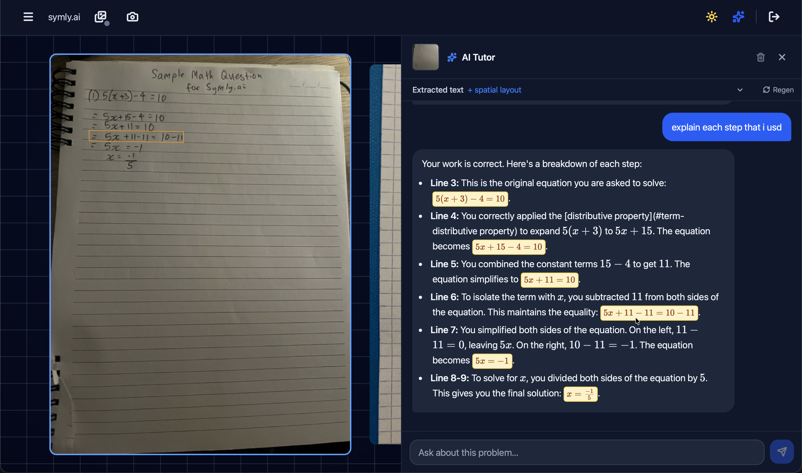
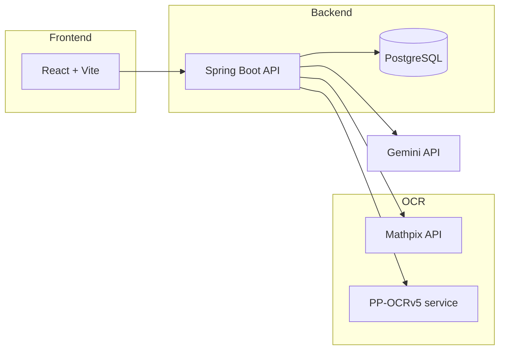

# Symly.ai

> **Archived.** This repository is open source for reference and learning. It is available for local usage.

**Symly.ai** is an AI math tutor system for handwritten homework. Upload a photo of a student's working, and the app extracts the math, maps it to spatial regions on the page, and lets you chat with an AI tutor that can reference specific lines and steps.



## What it does

- **Desk sessions** — organize photos of handwritten work into sessions, reorder them, and upload from desktop or phone (QR upload flow).
- **Hybrid OCR** — combines [Mathpix](https://mathpix.com/) for high-quality LaTeX with optional local [PP-OCRv5](https://github.com/PaddlePaddle/PaddleOCR) for per-line bounding boxes.
- **Expression steps** — groups OCR boxes into logical math steps using Mathpix layout + Google Gemini structured output.
- **Spatial AI tutor** — Gemini chat with a system prompt built from extracted text and layout; responses can link to specific lines/steps and highlight boxes on the image.
- **Persistent chat** — conversation history is stored per desk image.

## Architecture



**OCR pipeline (when local OCR is enabled):**

1. PP-OCRv5 detects text regions and polygon bounding boxes.
2. Mathpix extracts LaTeX for the full image.
3. Mathpix `line_data` defines semantic step regions; PP-OCR boxes that intersect each region are sent to Gemini in small batches.
4. Gemini returns grouped steps (`boxIds` + LaTeX text) used for debug UI and chat spatial references.

## Tech stack

| Layer | Stack |
|-------|--------|
| Frontend | React 19, TypeScript, Vite, Tailwind CSS, KaTeX, react-markdown |
| Backend | Spring Boot 3.5, Java 17, JPA, JWT auth, SSE notifications |
| Database | PostgreSQL 16 |
| Local OCR | Python, FastAPI, PaddleOCR PP-OCRv5 |
| External APIs | Mathpix, Google Gemini |

## Project structure

```
symbiol/
├── backend/          # Spring Boot API
├── frontend/         # React app
├── ocr-service/      # Optional PP-OCRv5 FastAPI service
├── docker-compose.yml
├── screenshot.png    # UI preview
└── setenv.sh         # Loads .env for local development
```

## Getting started

### Prerequisites

- Java 17+
- Node.js 20+
- Docker (for PostgreSQL)
- Python 3.10+ (optional, for local OCR)
- API keys: [Mathpix](https://mathpix.com/), [Google Gemini](https://ai.google.dev/)

### 1. Database

```bash
docker compose up -d
```

Create a `.env` file in the repo root (loaded by `setenv.sh`):

```bash
DB_NAME=symbiol
DB_USER=symbiol
DB_PASS=symbiol
DB_URL=jdbc:postgresql://localhost:5432/symbiol

JWT_SECRET=change-me-to-a-long-random-string
JWT_EXPIRATION=86400000

MATHPIX_APP_ID=your-app-id
MATHPIX_APP_KEY=your-app-key

GEMINI_API_KEY=your-gemini-key

# Optional — enables PP-OCRv5 bounding boxes
LOCAL_OCR_URL=http://localhost:8000
```

### 2. Backend

```bash
source setenv.sh
cd backend
./mvnw spring-boot:run
```

Runs on `http://localhost:8080`.

### 3. Frontend

```bash
cd frontend
npm install
npm run dev
```

Runs on `http://localhost:5173`. Override the API URL if needed:

```bash
VITE_API_URL=http://localhost:8080 npm run dev
```

### 4. Local OCR service (optional)

Without `LOCAL_OCR_URL`, the backend falls back to Mathpix text only (no PP-OCR bounding boxes or step grouping).

```bash
cd ocr-service
python -m venv .venv
source .venv/bin/activate
pip install -r requirements.txt
uvicorn main:app --host 0.0.0.0 --port 8000
```

## Development notes

- OCR results and chat history are cached in the database; use the regenerate/clear OCR controls in the UI or `DELETE /api/sessions/{id}/desk/{uid}/ocr` to re-run.
- The expression-step pipeline works best on clean, single-problem sheets. Dense worksheets with many matrices, multi-column layouts, and messy handwriting remain an area of experimentation — see git history around the Gemini/Mathpix split work.
- Frontend default API base: `http://localhost:8080` (`frontend/src/api/client.ts`).

## Status

This project was archived after reaching a useful prototype stage: the chat tutor understands page content well, but bbox step detection is still incomplete on complex layouts (large matrix derivations, overlapping regions, aggressive Mathpix grouping).

## License

[MIT](./LICENSE) — use, modify, and distribute freely. No warranty.
